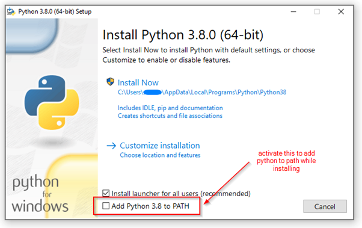
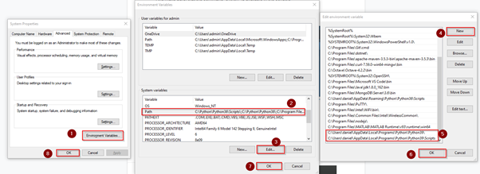
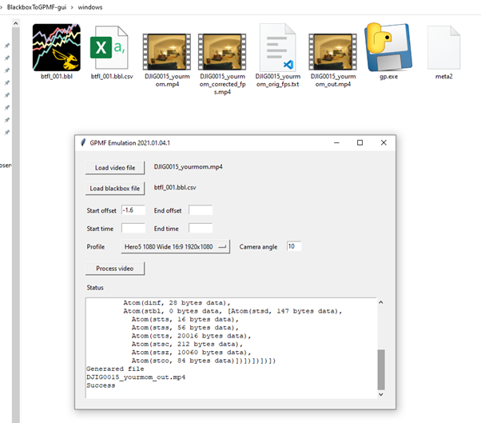

# Short tutorial for using GyroFlow

Example for Windows 10 and Betaflight

## Download & install Python

And make sure, that the commands “python” and “pip” are available in the console
(keyword “system environment variables” & “path”)

[https://www.python.org/downloads/](https://www.python.org/downloads/)




Alternative: Open the environment variables menu and add Python to the path variable manually




There are multiple places where Python can be installed like
- C:\Python\...
- C:\Program Files\Python\...
- C:\Users\[username]\AppData\Local\Programs\Python\...

Choose the path where the python.exe is!


Now open a NEW console


type in

```bash
python --version
pip --version
```


You should get the version numbers of the 2 applications! :)

### Background on environment variables:

The only function of the environment variable “path” is to make applications or scripts available from everywhere in the system (or the user environment if you choose user environment variables and not system).

Example:

- you open a console and the console path is C:\Users\daniel
- you type in “python --version”
- if the path to the python.exe is not defined in the environment variable “path” the console would give an error “python not found”
- thats because the python.exe is not at C:\Users\daniel but at C:\Python\Python39\ (for example)
- by setting the path in the environment variable “path”, the console looks up if the appropriate python.exe is in one of the paths defined in the path variable

## Make sure that your blackbox is able to record the logs


For longer videos / flights or if you don’t want to export your logs everytime the flash storage is full, you can use a FC with a microSD slot or you can do a mod where a SD card adapter is soldered to the FC.


## Fly and record the footage

In my example I use the footage from my DJI FPV goggles (with a Caddx Vista)-


You can export the log through “Activate Mass Storage Device Mode” in Betaflight Configurator.


## Open the blackbox file via the latest Betaflight Blackbox Explorer

You can find Betaflight Blackbox Explorer [here](https://github.com/betaflight/blackbox-log-viewer/releases).

Just pick the latest release and the OS version you need. For windows you use the ..._win32.exe


Open the log and the video in Blackbox Explorer. You can select both at once.


## Try to find a good sync offset at the start, the end or in the middle of the flight

**Pro tip**: Arm the copter and then roll or pitch or yaw just a little, but visibly. Then you can watch the gyro data and align it with the video visually.


## Save the log as csv


## Download & start BlackboxToGPMF

[https://github.com/Cleric-K/BlackboxToGPMF/tree/gui](https://github.com/Cleric-K/BlackboxToGPMF/tree/gui)

Start the gp.exe in windows folder


Or start the tool via ```python gp.py```

Make sure that the console path is the path where the gp.py is. ```cd``` stands for “change directory”.


## In some cases GPMF cannot read the mp4 video file correctly

[https://ffmpeg.org/download.html](https://ffmpeg.org/download.html)

for Windows see
[https://www.gyan.dev/ffmpeg/builds/](https://www.gyan.dev/ffmpeg/builds/)


- Download FFmpeg,
- go to the folder where the ffmpeg.exe lies,
- copy paste the video file in the same folder
- and execute via console:

```ffmpeg.exe -i videoinput.mp4 -pix_fmt yuv420p -c:v libx264 -crf 22 -preset ultrafast -tune film -c:a copy videooutput.mp4```

Make sure to change ```videoinput.mp4``` to the filename of your video file.


## Select the video and the csv in GPMF

Enter the offset you determined before.

Currently only ```GoPro Hero 5``` is working, enter also the camera angle and click on “Process video”.



If you have problems that GPMF doesn’t react on the offset you entered, just edit the csv and delete the appropriate pid loop samples:


## Download and use GyroFlow

[https://github.com/ElvinC/gyroflow](https://github.com/ElvinC/gyroflow)

Start GyroFlow via Console.

```python gyroflow.py```

Therefore you first have to install some libraries. Please keep in mind that the app is under heavy development. If you see something like “No module named ‘blaaa’” then just google that line and you find the appropriate library to add. :)


```bash
pip install opencv-python
pip install PySide2
pip install scipy
pip install orangebox
pip install construct
pip install numpy
pip install numpy python-dateutil pytz pyparsing six --force-reinstall --upgrade
pip install hachoir
pip install matplotlib
pip install vidgear
```


## Select the outputted video from GPMF

Try first to enter the original ratio (if you have a 1920x1080 video choose 1920x1080 as crop) to see how much you have to crop afterwards.

Set the autosync timestamps to positions in the footage where some shaky movements occuring.

Compute the sync. The orange lines should be on the green lines.

After this is done, export the file.


Crop the video by fiddling around with the output crop.

The development team of GyroFlow currently develops a dynamic zoom / crop feature.